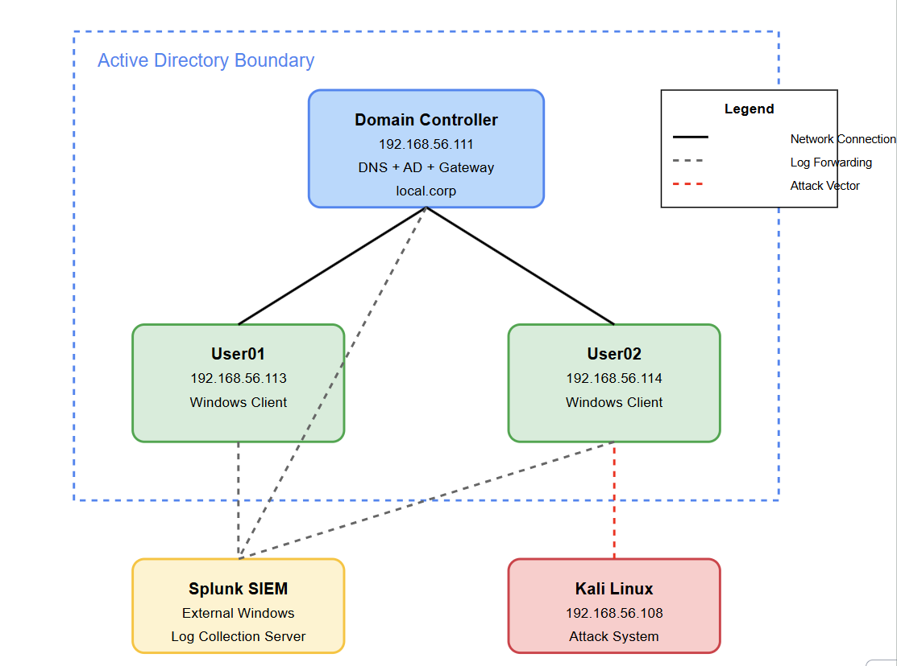

# AD-RansomGuard: Ransomware Detection in Active Directory Using Splunk Enterprise

A comprehensive simulation and detection framework for ransomware attacks targeting Active Directory environments, leveraging Splunk Enterprise for security monitoring and analysis.

## Project Overview

This project simulates a realistic ransomware attack within a controlled Active Directory environment while utilizing Splunk Enterprise for advanced detection and monitoring capabilities. By understanding both attack methodologies and detection mechanisms, organizations can better prepare their defensive strategies against such threats.

### Key Features

- Complete simulation of ransomware attack kill chain:
  - Initial compromise through targeted phishing
  - Privilege escalation using UAC bypass techniques
  - Credential harvesting from compromised systems
  - Lateral movement to domain controller
  - File encryption simulation with ransom note delivery

- Robust detection capabilities using Splunk Enterprise:
  - Real-time monitoring of Windows Event Logs
  - Custom correlation rules for ransomware IOCs
  - Alerting on suspicious activities (Meterpreter sessions, PowerShell execution)
  - Dashboard visualization of attack progression

## Environment Setup

The simulation environment consists of:

- Kali Linux (attacker system)
- Two Windows 10 client machines (domain-joined)
- Windows Server 2019 (Active Directory Domain Controller)
- Splunk Enterprise instance with forwarders on all Windows systems

  

## Attack Simulation

The attack employs common tools and techniques used by ransomware operators:

- Metasploit Framework for exploitation
- Custom msfvenom payloads for initial access
- UAC bypass through bypassuac_fodhelper
- Credential harvesting using Kiwi/Mimikatz
- SMB exploitation for lateral movement
- PowerShell for file encryption simulation

## Detection Methodology

Splunk Enterprise is configured to detect each stage of the attack through:

- Windows Event Log monitoring and correlation
- PowerShell script execution tracking
- Authentication event analysis
- File modification detection
- Custom alerting rules and dashboards

## Results & Key Findings

- Single compromised endpoint can lead to domain-wide compromise
- Cached credentials pose significant security risks
- Real-time log aggregation is critical for early detection
- Splunk provides effective visibility across the entire attack chain

## Future Work

Potential areas for further development:

- Machine learning-based anomaly detection
- Automated incident response capabilities
- Integration with threat intelligence
- Implementation of Zero Trust principles

## Author

- Nikhil Gauti
